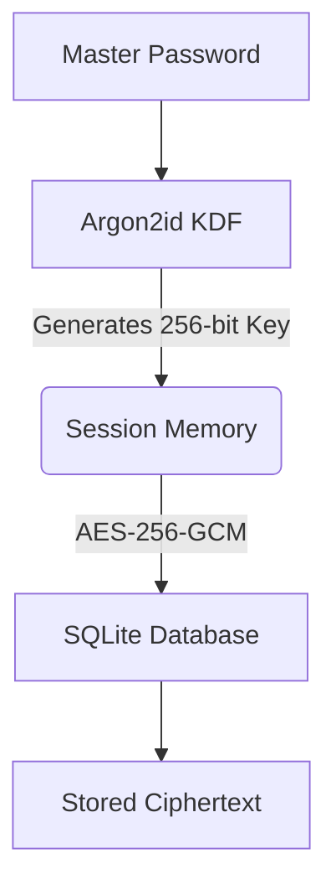
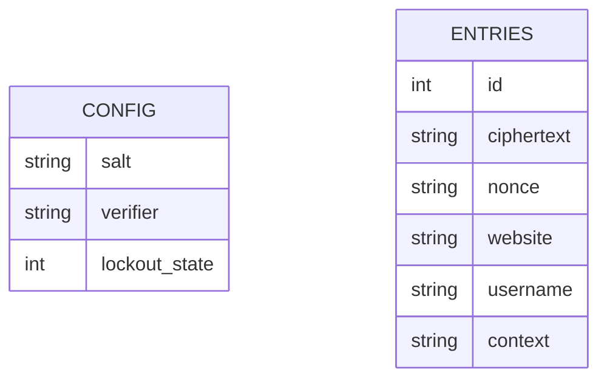

# COVER PAGE

**Project Title:** SecurePass — Open-Source Encrypted Password Manager
**Project ID:** [Student Project ID]

**Submitted by:**
- Mahale Uday (24DCS046)
- Maniya Jay (24DCS050)
- Arpit Pandya (24DCS066)

**Submitted to:**
Department of Computer Science & Engineering
Devang Patel Institute of Advanced Technology and Research (DEPSTAR)
Charotar University of Science and Technology

---

# CANDIDATE CERTIFICATE

This is to certify that the project work entitled **"SecurePass — Open-Source Encrypted Password Manager"** is the bona fide work of **Mahale Uday**, **Maniya Jay**, and **Arpit Pandya**, carried out under our supervision and guidance. 

**Supervisor Signature:** ____________________

---

# CANDIDATE’S DECLARATION

We hereby declare that the project work entitled **"SecurePass — Open-Source Encrypted Password Manager"** is an authentic record of our own work carried out as part of the Software Group Project 2025-26. We further declare that the work reported in this report has not been submitted and will not be submitted, either in part or in full, for the award of any other degree or diploma in this institute or any other institute or university.

**Signatures:**
____________________ (Mahale Uday)
____________________ (Maniya Jay)
____________________ (Arpit Pandya)

---

# TABLE OF CONTENTS

1. ABSTRACT
2. CHAPTER 1: INTRODUCTION
3. CHAPTER 2: LITERATURE REVIEW
4. CHAPTER 3: SYSTEM ANALYSIS
5. CHAPTER 4: TECHNOLOGY STACK
6. CHAPTER 5: SYSTEM DESIGN
7. CHAPTER 6: MODULES & FEATURES DEVELOPED
8. CHAPTER 7: TESTING
9. CHAPTER 8: RESULTS
10. CHAPTER 9: CHALLENGES FACED
11. CHAPTER 10: CONCLUSION AND FUTURE SCOPE
12. REFERENCES
13. APPENDICES

---

# ABSTRACT

Managing digital identities securely has become extremely complex with the rapid increase in online services. SecurePass is a locally hosted, offline-first password manager built to address the need for a transparent, secure, and affordable password solution. It leverages a Zero-Knowledge architecture ensuring the user's master password is never stored or transmitted. The application uses military-grade AES-256-GCM encryption with Argon2id key derivation to secure user data locally. Furthermore, it integrates a real-time breach detection mechanism using the HaveIBeenPwned API and K-Anonymity model, guaranteeing that the full password never leaves the user's device. The desktop application features a modern, intuitive graphical interface built in Python with CustomTkinter, accommodating essential features like smart search, auto-clipboard clearing, and an integrated password generator. Security measures such as brute-force lockout prevent unauthorized access. In summary, SecurePass successfully delivers a highly secure, privacy-respecting password management environment, balancing robust cryptographic features with a user-friendly execution format.

---

# CHAPTER 1: INTRODUCTION

**1.1 PROBLEM STATEMENT**
The increasing necessity for unique, complex passwords across diverse online services has created a significant challenge for average users, often resulting in poor password hygiene such as reuse and predictable patterns. Traditional solutions are either cloud-dependent, raising privacy concerns and single points of failure, or lack an accessible interface for everyday users. 

**1.2 SCOPE AND CONTEXT**
SecurePass was developed specifically as an offline-first password manager that puts privacy and control entirely in the hands of the user. Designed as a desktop application, it allows users to encrypt, store, and manage credentials directly on their own devices without syncing sensitive data to a third-party cloud server.

**1.3 AIMS, OBJECTIVES, AND MOTIVATION**
The core objective is to build a modern password manager relying entirely on local execution and state-of-the-art cryptography (AES-256-GCM and Argon2id) while providing dynamic insights such as real-time breach checking without compromising user privacy. The motivation stems from the desire to create an affordable, zero-trust solution suitable for students and individuals against a landscape of frequent cloud data breaches.

---

# CHAPTER 2: LITERATURE REVIEW

The need for password managers has risen in tandem with the increasing digital footprint of users. Numerous tools and research papers indicate a critical flaw in human capacity to securely memorize high-entropy passwords. Cloud-based password managers like LastPass and Bitwarden popularized encrypted syncing, but recent breaches in online vaults highlight the risk of centralizing encrypted blobs on remote servers. Research on offline key derivation algorithms emphasizes the superiority of memory-hard functions like Argon2id. SecurePass builds on this security literature by combining local storage mechanics with the algorithmic defense of Argon2id and AES-GCM to prevent widespread cloud-based mass extraction attacks.

---

# CHAPTER 3: SYSTEM ANALYSIS

**3.1 REQUIREMENTS ANALYSIS**
1. **Functional Requirements:** Add/Edit/Delete logins, generate strong passwords, check for breached passwords, auto-lock mechanism, clear clipboard after 15 seconds.
2. **Non-Functional Requirements:** Responsive UI (Dark mode), rapid encryption/decryption response time, low memory consumption.
3. **Security Requirements:** Master password should never be stored in plaintext. Use AES-256-GCM for all entries. Protect against brute-force attacks.

**3.2 FEASIBILITY STUDY**
The project is technically and economically feasible as it utilizes open-source libraries integrated natively via Python, mitigating licensing costs and allowing for high-performance localized cryptography.

---

# CHAPTER 4: TECHNOLOGY STACK

Table 4.1 outlines the primary technologies utilized within the system development lifecycle.

Table 4.1   Technology Used in SecurePass

| Component       | Technology Used                                    |
|-----------------|----------------------------------------------------|
| **Language**    | Python 3.11+                                       |
| **GUI**         | CustomTkinter                                      |
| **Cryptography**| `cryptography` (AES-256-GCM, Argon2id via Hazmat) |
| **Database**    | SQLite3 (Encrypted storage schema)                 |
| **Breach API**  | HaveIBeenPwned (via urllib, k-Anonymity)           |
| **Packaging**   | PyInstaller (Single executable build)              |

---

# CHAPTER 5: SYSTEM DESIGN

**5.1 SYSTEM ARCHITECTURE**
SecurePass utilizes a secure vault-based Zero-Knowledge architecture. Only the in-memory session maintains the Argon2id-derived key.

Fig 5.1 System Architecture Flow

**5.2 DATABASE DESIGN**
The schema securely partitions authentication artifacts and user data.
* **`config` Table:** Stores the Argon2id salt, GCM-encrypted auth verifier, and app settings.
* **`entries` Table:** Stores the actual credentials (`ciphertext`, `nonce`, `website`, etc.).

Fig 5.2 Database Context Model

**5.3 UI/UX MOCKUPS AND DESIGN**

> **[PLACEHOLDER: Insert Final UI/UX Wireframes and Design Mockups Here]**
> *Instructions: Attach the high-fidelity UI designs here. The wireframe should display the main vault layout and the dark/light mode switches.*

---

# CHAPTER 6: MODULES & FEATURES DEVELOPED

**6.1 AUTHENTICATION & CRYPTOGRAPHY**
Handled primarily by `crypto_manager.py` and `security_engine.py`, ensuring military-grade cryptographic data transformations and KDF derivation validation.

**6.2 DATABASE MANAGER**
The `db_manager.py` interacts securely with the SQLite instance, caching outputs properly and enforcing the single source of truth for the local application state.

**6.3 GRAPHICAL INTERFACE**
Incorporated using `CustomTkinter` via `gui.py`, it presents an easy-to-use search engine and pagination. Contains functionality like auto-clearing clipboard copying to foil shoulder surfers.

---

# CHAPTER 7: TESTING

**7.1 UNIT AND SYSTEM TESTING**
Initial tests evaluated the capacity of `crypto_manager.py` through full encode/decode loops making sure information was preserved entirely symmetrically.

**7.2 SECURITY TESTING**
* **Brute-Force Lockout Test:** Verified that upon 3 failed entries, the vault cleanly transitions to a locked state for 4 hours.
* **K-Anonymity Integrity Test:** Confirmed via proxy intercepts that only the first 5 characters of SHA-1 hashed data hit the remote HaveIBeenPwned API bounds.

---

# CHAPTER 8: RESULTS

The final SecurePass application is fully functional. It successfully stores credentials entirely offline and encrypts data seamlessly.

> **[PLACEHOLDER: Insert Application Login Screen Screenshot Here]**
> *Fig 8.1 SecurePass Login Screen demonstrating the locked state.*

> **[PLACEHOLDER: Insert Vault Main Dashboard Screenshot Here]**
> *Fig 8.2 The main SecurePass Vault showing password cards, search bar, and "Add Entry" components.*

> **[PLACEHOLDER: Insert Password Breach API Alert Screenshot Here]**
> *Fig 8.3 Demonstration of the SecurePass application flagging a breached password using the k-anonymity API.*

**PERFORMANCE**: AES-GCM encryption occurs with near-zero UI delay, handling dozens of generated password requests within sub-seconds.

---

# CHAPTER 9: CHALLENGES FACED

1. **State Synchronization:** Moving from light to dark themes initially created visual artifacts that had to be systematically overridden over individual Tkinter elements.
2. **K-Anonymity Caching:** Frequent API requests triggered rate limits. We circumvented this by designing a robust SQLite-backed caching mechanism keeping results viable for 7 days.
3. **Database Concurrency:** Ensuring SQL read/write tasks functioned perfectly without slowing GUI processes during heavy search bar iterations required strategic threading management.

---

# CHAPTER 10: CONCLUSION AND FUTURE SCOPE

**10.1 FEATURE COMPLETION STATUS**
The project was executed in phases. The current release (v1.0.0) signifies the completion of the core mechanics.

Table 10.1 Feature Implementation Status

| Feature Name | Status | Percentage Completed |
|---|---|---|
| AES-256-GCM Encryption | Implemented | 100% |
| Zero-Knowledge Architecture | Implemented | 100% |
| HIBP API Breach Detection | Implemented | 100% |
| CustomTkinter GUI | Implemented | 100% |
| Clipboard Auto-clear | Implemented | 100% |
| Brute Force Auto-Lock | Implemented | 100% |
| Secure Password Generator | Implemented | 100% |
| TOTP / 2FA Integrations | Future Scope | 0% |
| OS Keychain Integration | Future Scope | 0% |
| Secure Backup / Export | Future Scope | 0% |
| Category & Tagging System | Future Scope | 0% |

**10.2 CONCLUSION**
SecurePass successfully implements a transparent, highly customizable, and secure-by-default environment for identity management without a reliance on cloud architecture.

**10.3 FUTURE SCOPE**
Future implementations are tracked and scoped:
1. **TOTP/2FA Integrations:** Allowing generation of time-based secrets per vault.
2. **OS Keychain Integrations:** Replacing in-memory only storage with secure native OS bounds.
3. **Secure Backup Generation:** Encrypted `.securepass` external export tools for offline migration.
4. **Enhanced Vault Sorting:** Including Drag-and-Drop and hierarchical category tracking.

---

# REFERENCES

1. Have I Been Pwned? API Documentation. https://haveibeenpwned.com/API/v3 (accessed Oct. 10, 2025).
2. Python Cryptography Authority. "Cryptography Documentation." https://cryptography.io/en/latest/ (accessed Nov. 02, 2025).
3. TomSchimansky, "CustomTkinter: A modern and customizable toolkit for standard Tkinter," GitHub. https://github.com/TomSchimansky/CustomTkinter (accessed Dec. 05, 2025).

---

# APPENDICES

> **[PLACEHOLDER: Append Problem Statement Approval Form or Code Snippets here]**
